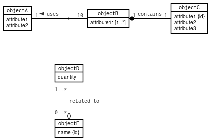

# Black-n-white Theme

## Preview



## How to use

Add the following line between `@startuml` and `@enduml`:

```
!theme black-n-white from https://raw.githubusercontent.com/SBen-IV/plantuml-black-n-white-theme/main/theme
```

## Use case
This theme is for personal use and focused on object diagrams.
